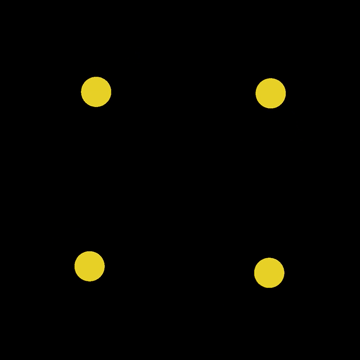

# Gravitational Acceleration Simulation

## Features

- Thousands of particles simulated.
- Gravitational forces calculated between every possible pair of particles, every frame. (Multithreaded O(n^2).)
- Collision detection combines particles whenever they touch. (Circle collision.)
- Technologies: C++20, OpenGL. CUDA coming soon.

## Development

Curious about how a solar system forms inside a nebula, I tried simulating the gravitational collapse of a rotating cloud of particles in space using C++20 code. The result was more chaotic than I expected.

First, however, testing some basic simulated gravity was necessary. I set up [Newton's Law of Universal Gravitation](https://en.wikipedia.org/wiki/Newton%27s_law_of_universal_gravitation) with idealized particles.

If you watch closely, the two red particles are slowly falling into each other until they collide into a bigger orange particle.

Particles in this simulation instantly combine whenever they touch, which isn't like the real world where things can bounce, bend, spin, and pieces can break off, but it should be good enough for my needs.

That gravity looks generally correct, but it isn't very exciting. Let's make the two particles slightly more interesting:

OK, gravity is working. Still, I had to test a [Klemperer Rosette](https://en.wikipedia.org/wiki/Klemperer_rosette), which is a number of bodies rotating at an equal distance from a common center:

From here on the videos may be sped up.

Klemperer Rosettes can have 3, 4, 5, or even more objects all rotating around each other, but they're normally unstable and not found in nature. Any tiny perturbations in the gravitational forces will be amplified, so it doesn't take long before the square falls apart:

What I'm actually interested in here are solar systems with a large, central, "star" surrounded by planets and debris. Here's a simple "solar system" with only four particles:

I hand-crafted the four-particle solar system, above, but I want to see a unique solar system evolve spontaneously from a dense cloud nebula in space. At this point I cranked the particle count waaaay up. There are over 7,000 particles in this next video.

All 7,000 particles quickly fell into the "sun", which was anti-climactic. Only one huge particle/sun, and no planets. What went wrong?

My first idea was that nearly everything in the sky is spinning. In fact, if something in the real sky ever wasn't spinning, gravity and other forces would eventually likely make the thing spin, at least a little bit.

Nebulas are probably spinning as well. Adding rotation to the particle cloud makes a big difference:

Now that collapse was chaotic, even violent. At the end, a binary star system formed like in Star Wars. I like it.

Unfortunately all the planets were flung away. After many runs of the simulation, this appears to be common. Most of the material collapses into one, two, or occasionally three large stars, and everything else is lost in space.

Next steps: I suspect something called bombardment is involved with planetary formation. I'm not an astronomer, but I'll try reading up on this subject and I'll add to the simulation an option for particles to continue falling onto the protostar for a longer period of time.

## Dependencies

- [GLFW](https://www.glfw.org/docs/latest/build_guide.html#build_link_cmake_source)
- [csv-parser](https://github.com/ashaduri/csv-parser) (included)
- [glad](https://glad.dav1d.de/) (included)
- [glm](https://github.com/g-truc/glm) (included)

## To-Do

- Command-line options.
- Decouple the particle simulation from the graphical renderer.
- Numerical Integration.
- CUDA acceleration.
- 3-D.
