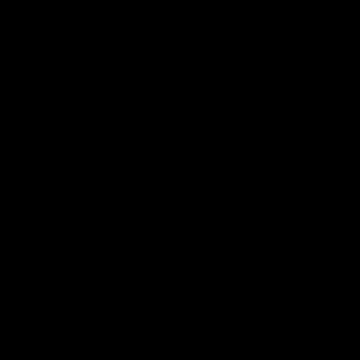

# Gravitational Acceleration Simulation

## Features

- Thousands of particles simulated.
- Gravitational forces calculated between every possible pair of particles, every frame. (Multithreaded O(n<sup>2</sup>)).
- Collision detection combines particles whenever they touch. (Circle collision.)
- Technologies: C++20, OpenGL. CUDA coming soon.


## Building

``` sh
$ git clone --recurse-submodules https://github.com/corecursion/gravity-simulation.git
$ cd gravity-simulation
$ mkdir build
$ cmake -B build
$ cmake --build build
$ build/gravity-simulation
```


## Gallery

Particles in this simulation instantly combine whenever they touch, which isn't like the real world where things can bounce, bend, spin, and pieces can break off, but it should be good enough for experimenting with large-scale gravitational forces.

Basic testing of [Newton's Law of Universal Gravitation](https://en.wikipedia.org/wiki/Newton%27s_law_of_universal_gravitation) with idealized particles simulated using C++20:




The yellow square is a [Klemperer Rosette](https://en.wikipedia.org/wiki/Klemperer_rosette) which is a number of bodies rotating at an equal distance from a common center. Klemperer Rosettes don't normally occur in nature because they're unstable. Any tiny perturbations in the gravitational forces will be amplified, so it doesn't take long before the square falls apart.

(From here on the videos may be sped up.)


A hand-crafted, four-particle, "solar system":


Next up is a bigger test of over 7,000 particles. All the particles quickly collapse into a single "sun", which is anti-climactic:


Adding rotation to the particle cloud makes a big difference, allowing more structure to form:


Next steps: I'm interested in simulating how a solar system [forms](https://en.wikipedia.org/wiki/Formation_and_evolution_of_the_Solar_System) spontaneously from a cloud of dust and gas, so the plan is to add an option for new particles to continue falling onto the system for a long period of time.


## Dependencies

- [GLFW](https://www.glfw.org/docs/latest/build_guide.html#build_link_cmake_source)
- [csv-parser](https://github.com/ashaduri/csv-parser) (included)
- [glad](https://glad.dav1d.de/) (included)
- [glm](https://github.com/g-truc/glm) (included)


## To-Do

- Command-line options.
- Decouple the particle simulation from the graphical renderer.
- Numerical Integration.
- CUDA acceleration.
- 3-D.
